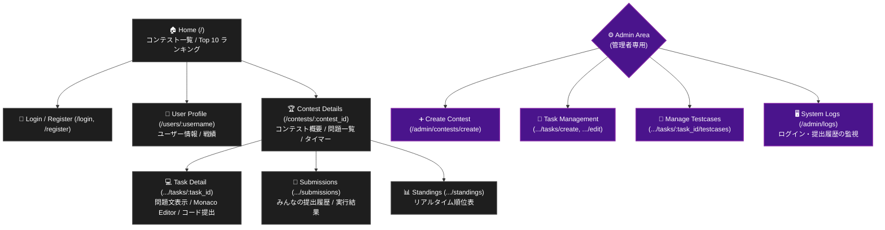

# 🏆 Competitive Programming Platform (Contentio)

[](https://reactjs.org/)
[](https://www.typescriptlang.org/)
[](https://www.rust-lang.org/)
[](https://github.com/tokio-rs/axum)
[](https://www.sqlite.org/)

AtCoderやLeetCodeのような競技プログラミングプラットフォームをローカル環境で構築・実行できるフルスタックWebアプリケーションです。

## ✨ 主な機能 (Features)

* **🔐 ユーザー認証・権限管理**
  * `bcrypt` を用いたパスワードハッシュ化とセキュアなログイン。
  * 一般ユーザーと管理者（Admin）の権限分離。
* **📝 コンテスト＆問題管理 (Admin機能)**
  * 開催日時と制限時間を指定したコンテストの作成。
  * Markdown（数式 `KaTeX`・画像リンク対応）によるリッチな問題文とコンテスト説明文の作成。
  * ブラウザ上でのテストケース（入出力データ）の追加・削除機能。
* **💻 高機能ブラウザエディタ**
  * `Monaco Editor` を統合し、VS Codeライクな記述体験（シンタックスハイライト、オートコンプリート）を提供。
  * C++の競技プログラミング用スニペット（テンプレート、`rep` マクロ等）を標準搭載。
  * 「問題文のみ」「左右分割」「エディタ全画面」のシームレスなUI切り替え。
* **🚀 ローカルジャッジシステム**
  * 提出されたC++コードをバックエンドで自動コンパイル＆テストケース実行。
  * `AC` (正解), `WA` (不正解), `TLE` (時間切れ), `CE` (コンパイルエラー), `RE` (実行時エラー) のステータス判定。
* **📊 リアルタイム順位表とレーティング**
  * ペナルティと正答数に基づいたリアルタイムな順位表（Standings）。
  * コンテスト終了後のゼロサム方式レーティング計算システム（グローバルランキング連動）。
* **🖥️ システムログ**
  * ログイン、提出、レーティング計算などのシステムアクションを記録・閲覧可能。

## 🛠️ 技術スタック (Tech Stack)

| Category | Technology |
| :--- | :--- |
| **Frontend** | React, TypeScript, Vite, Material UI (MUI), Monaco Editor, React-Markdown |
| **Backend** | Rust, Axum, SQLx, Tokio |
| **Database** | SQLite |
| **Judge Env**| GCC (`g++`) via `std::process::Command` |

## 🗺️ サイトマップ (Page Structure)

アプリケーションのURL構成と各ページの役割は以下の通りです。



## ⚙️ 環境構築 (Prerequisites)

このアプリケーションをローカルで動かすには、以下のインストールが必要です。

1. **Node.js** (v18以上推奨)
2. **Rust & Cargo** (最新版)
3. **GCC (`g++`)**: ジャッジシステムがC++をコンパイルするために必要です。
   * Windowsの場合は [MSYS2](https://www.msys2.org/) 等からインストールし、環境変数（PATH）に `g++` を追加してください。
4. **sqlx-cli**: データベースの構築に必要です。
   ```bash
   cargo install sqlx-cli
   ```

## 🚀 セットアップと起動 (Getting Started)

### 1. リポジトリのクローン
```bash
git clone https://github.com/nekomanma634/Contentio.git
cd Contentio
```

### 2. バックエンドの起動 (Rust)
```bash
cd backend

# データベースURLの環境変数を設定 (Windows PowerShell の場合)
$env:DATABASE_URL="sqlite:localcoder.db"

# データベースファイルの作成とテーブル構築
sqlx database create
sqlx migrate run

# サーバーの起動 (http://127.0.0.1:3000)
cargo run
```

### 3. フロントエンドの起動 (React)
別のターミナルを開き、フロントエンドディレクトリに移動して起動します。
```bash
cd frontend

# パッケージのインストール
npm install

# サーバーの起動
npm run dev
```
ブラウザで `http://localhost:5173` にアクセスするとアプリが表示されます。

---

## 📖 使用方法 (Usage Guide)

### ステップ 1: 管理者アカウントの作成
1. 右上の「Register」から、Usernameを `admin` としてアカウントを作成します。
   > **Note:** `admin` という名前で登録すると、自動的に管理者権限が付与されます。

### ステップ 2: コンテストと問題の作成
1. 管理者でログインし、「Create Contest」ページから新しいコンテストを作成します。
2. 作成したコンテストのページを開き、「+ Add Task」から問題を作成します。問題文には Markdown（数式 `KaTeX` 対応）が使用できます。
3. 問題一覧の右端にある **フラスコアイコン（🧪）** をクリックし、テストケース（入力データと期待される出力データ）を登録します。
4. コンテスト詳細ページの「Edit」ボタンから、コンテスト全体のルールや説明文を Markdown 形式で追加できます。画像のURLを指定して埋め込むことも可能です。

### ステップ 3: コードの提出とジャッジ
1. 任意のユーザーでコンテストページから問題を開き、右側のエディタ（Monaco Editor）で C++ コードを記述します。
   > **Tip:** エディタ内で `temp` と入力して `Enter` を押すと、競プロ用の C++ テンプレートが自動展開されます。
2. 「Submit Code」を押すと、バックエンドで `g++` によるコンパイルとジャッジが実行され、即座に結果（`AC`, `WA` など）が返ります。
   > **Note:** コンテスト開始前や終了後は、コードの提出が自動的にロックされます。

### ステップ 4: 順位表とレーティング
1. コンテスト上部の「Standings」タブから、参加者のリアルタイムな順位とペナルティ（AC数・WA数など）を確認できます。
2. コンテストの終了時間を過ぎると、管理者の画面にのみ **「★ Calculate Ratings」** ボタンが出現します。
3. ボタンを押すと、順位に基づいたゼロサム方式のレーティングが計算され、サイト全体の「Ranking」に色が反映されます。

### ステップ 5: システムの監視
1. 管理者アカウントでログイン中、URLに直接 `/admin/logs` と入力してアクセスすることで、システムログ画面を開けます。
2. ユーザーのログイン、提出履歴、レーティング計算などのアクションがリアルタイムで記録・閲覧可能です。