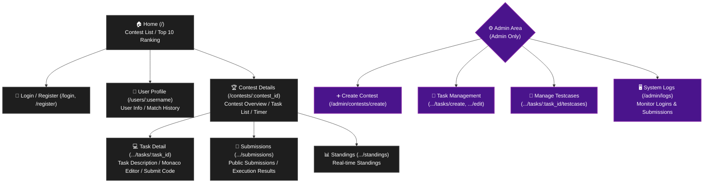

# 🏆 Competitive Programming Platform (Contentio)

[](https://reactjs.org/)
[](https://www.typescriptlang.org/)
[](https://www.rust-lang.org/)
[](https://github.com/tokio-rs/axum)
[](https://www.sqlite.org/)

A full-stack web application that allows you to build and run a competitive programming platform like AtCoder or LeetCode entirely in your local environment.

## ✨ Features

* **🔐 User Authentication & Role Management**
  * Secure login with password hashing using `bcrypt`.
  * Role separation between regular users and Administrators (Admin).
* **📝 Contest & Task Management (Admin Feature)**
  * Create contests with specific start dates, times, and durations.
  * Create rich task descriptions and contest rules using Markdown (supports `KaTeX` for math equations and image embeds).
  * Add and delete test cases (input/output data) directly from the browser.
* **💻 Advanced Browser Editor**
  * Integrated `Monaco Editor` for a VS Code-like coding experience (syntax highlighting, auto-completion).
  * Built-in C++ snippets for competitive programming (templates, `rep` macros, etc.).
  * Seamless UI switching between 'Task only', 'Split view', and 'Full-screen editor'.
* **🚀 Local Judge System**
  * Automatic backend compilation and test case execution for submitted C++ code.
  * Status judgments: `AC` (Accepted), `WA` (Wrong Answer), `TLE` (Time Limit Exceeded), `CE` (Compilation Error), and `RE` (Runtime Error).
* **📊 Real-time Standings & Ratings**
  * Real-time standings based on the number of accepted tasks and penalty time.
  * Zero-sum rating calculation system applied after contests (linked to the global ranking and user color tiers).
* **🖥️ System Logs**
  * Record and view system actions such as logins, submissions, and rating calculations in real-time.

## 🛠️ Tech Stack

| Category | Technology |
| :--- | :--- |
| **Frontend** | React, TypeScript, Vite, Material UI (MUI), Monaco Editor, React-Markdown |
| **Backend** | Rust, Axum, SQLx, Tokio |
| **Database** | SQLite |
| **Judge Env**| GCC (`g++`) via `std::process::Command` |

## 🗺️ Page Structure (Site Map)

The URL structure and the role of each page in the application:



## ⚙️ Prerequisites

To run this application locally, you need to install the following:

1. **Node.js** (v18 or higher recommended)
2. **Rust & Cargo** (Latest version)
3. **GCC (`g++`)**: Required for the judge system to compile C++ code.
   * For Windows, install via [MSYS2](https://www.msys2.org/) or MinGW, and add `g++` to your environment variables (PATH).
4. **sqlx-cli**: Required for database setup.
   ```bash
   cargo install sqlx-cli
   ```

## 🚀 Getting Started

### 1. Clone the repository
```bash
git clone [https://github.com/nekomanma634/Contentio.git](https://github.com/nekomanma634/Contentio.git)
cd Contentio
```

### 2. Run the Backend (Rust)
```bash
cd backend

# Set the database URL environment variable (Example for Windows PowerShell)
$env:DATABASE_URL="sqlite:localcoder.db"

# Create the database file and run migrations
sqlx database create
sqlx migrate run

# Start the server ([http://127.0.0.1:3000](http://127.0.0.1:3000))
cargo run
```

### 3. Run the Frontend (React)
Open another terminal, navigate to the frontend directory, and start the development server.
```bash
cd frontend

# Install dependencies
npm install

# Start the server
npm run dev
```
Open your browser and navigate to `http://localhost:5173` to see the app.

---

## 📖 Usage Guide

### Step 1: Create an Admin Account
1. Click "Register" in the top right corner and create an account with the Username `admin`.
   > **Note:** Registering with the exact name `admin` will automatically grant you administrator privileges.

### Step 2: Create Contests and Tasks
1. Log in as an admin and navigate to the "Create Contest" page to set up a new contest.
2. Open the created contest page and click "+ Add Task" to create a task. You can use Markdown (with `KaTeX` support) for the task description.
3. Click the **Flask icon (🧪)** on the right side of the task list to register testcases (input data and expected output data).
4. Click the "Edit" button on the contest details page to add overall contest rules and descriptions in Markdown format. You can also embed images using their URLs.

### Step 3: Submit Code and Judge
1. Log in as any user, open a task from the contest page, and write C++ code in the editor (Monaco Editor) on the right.
   > **Tip:** Type `temp` in the editor and press `Enter` to automatically expand a C++ boilerplate for competitive programming.
2. Click "Submit Code" to execute compilation and judging via `g++` in the backend, and get immediate results (e.g., `AC`, `WA`).
   > **Note:** Code submissions are automatically locked before the contest starts and after it ends.

### Step 4: Standings and Ratings
1. Check real-time participant rankings and penalties (e.g., number of ACs and WAs) from the "Standings" tab at the top of the contest page.
2. After the contest end time has passed, the **"★ Calculate Ratings"** button will appear *only* on the admin's screen.
3. Click the button to calculate zero-sum ratings based on the final standings, which will be reflected with user colors on the site-wide "Ranking" page.

### Step 5: System Monitoring
1. While logged in as an admin, directly access `/admin/logs` in the URL to open the system logs page.
2. Monitor actions such as user logins, submission history, and rating calculations in real-time.